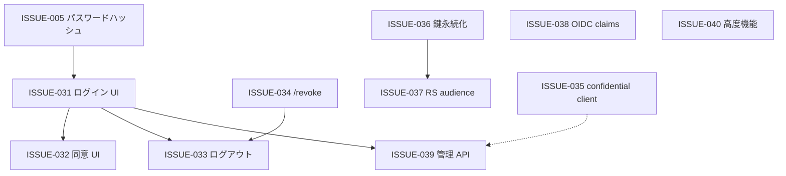

# AUTH-002 実装計画: app/auth OAuth/OIDC ギャップ解消ロードマップ

- **起点 Spec**: `docs/specs/20260712-015-web-oidc-authentication.md`(SPEC-015。E2E 最小連携は done)
- **現状基盤**: AUTH-001(app/auth 基盤)、SPEC-006(refresh_token グラント)
- **対象 stack**: 主に `app/auth`。一部は `app/api` / `app/web` / `app/iac` 横断(ISSUE-037)
- **方針**: 本番 IdP 相当へ段階的に拡張する。各フェーズは独立 Issue + 個別 plan(必要時)で着手可能にする

---

## 1. 背景(何が足りないか)

SPEC-015 時点の app/auth は **Authorization Code + PKCE(S256) + refresh_token + Discovery/JWKS/UserInfo** の基盤サンプルとして動作する。一方、README / AUTH-001 で「将来拡張点」と明記された IdP 機能・OAuth 標準エンドポイント・本番運用要件の多くは未実装。

本ロードマップは、前回整理したギャップを **Issue 単位に分解**し、**推奨実装順序**と**依存関係**を固定する。

---

## 2. Issue 一覧とフェーズ

### 既存 Issue(本ロードマップで参照。新規起票しない)

| ID | タイトル(要約) | 関係 |
|---|---|---|
| ISSUE-005 | デモユーザーパスワード平文保持 | ISSUE-031(ログイン UI)着手前に解消推奨 |
| ISSUE-015 | 認可コードの定期 purge 欠如 | 運用 hardening。Phase 4 と並行可 |
| ISSUE-019 | refresh_token deferred hardening(GC / タイミング差) | 運用 hardening。Phase 4 と並行可 |

### Phase 1 — IdP ユーザー体験(認証・同意・ログアウト)

| 順 | Issue | 概要 | 主担当 |
|---|---|---|---|
| 1.1 | [ISSUE-031](../issues/20260712-031-auth-login-ui-idp-session.md) | ログイン UI + IdP セッション | impl-auth, impl-web(画面) |
| 1.2 | [ISSUE-032](../issues/20260712-032-auth-consent-ui.md) | 同意(consent) UI | impl-auth, impl-web |
| 1.3 | [ISSUE-033](../issues/20260712-033-auth-rp-initiated-logout-end-session.md) | RP-initiated logout / end_session | impl-auth, impl-web |

**ゲート**: ISSUE-031 は ISSUE-005(パスワードハッシュ化)を先行させる。

### Phase 2 — トークンライフサイクル・鍵管理

| 順 | Issue | 概要 | 主担当 |
|---|---|---|---|
| 2.1 | [ISSUE-034](../issues/20260712-034-auth-token-revocation-endpoint.md) | `POST /revoke`(RFC 7009) | impl-auth |
| 2.2 | [ISSUE-036](../issues/20260712-036-auth-rsa-key-persistence-jwks-rotation.md) | RSA 鍵永続化・JWKS 複数鍵 | impl-auth, impl-iac(秘密管理) |
| 2.3 | [ISSUE-038](../issues/20260712-038-auth-oidc-claims-offline-access.md) | `auth_time` / `at_hash` / `offline_access` ゲート | impl-auth |

**ゲート**: ISSUE-036 は compose / ECS 再起動でトークンが全失効する問題の解消。本番前必須。

### Phase 3 — クライアント種別とリソースサーバー連携

| 順 | Issue | 概要 | 主担当 |
|---|---|---|---|
| 3.1 | [ISSUE-035](../issues/20260712-035-auth-confidential-client.md) | Confidential client(`client_secret`) | impl-auth, impl-db |
| 3.2 | [ISSUE-037](../issues/20260712-037-auth-resource-server-audience.md) | access token `aud` を API 向けに設計 | impl-auth, impl-api, impl-web |

**ゲート**: ISSUE-037 は SPEC-015 の「aud=iss 再利用」を本格 OAuth RS パターンへ移行する横断変更。

### Phase 4 — 管理・運用 API

| 順 | Issue | 概要 | 主担当 |
|---|---|---|---|
| 4.1 | [ISSUE-039](../issues/20260712-039-auth-client-user-management.md) | クライアント / ユーザー管理(seed 以外) | impl-auth, impl-db |
| 4.2 | ISSUE-015 / ISSUE-019 | 短命エンティティ GC・deferred hardening | impl-auth, impl-db |

### Phase 5 — 高度機能(必要時)

| 順 | Issue | 概要 | 主担当 |
|---|---|---|---|
| 5.1 | [ISSUE-040](../issues/20260712-040-auth-advanced-oauth-oidc-features.md) | introspection / DPoP / mTLS / prompt / CORS 等 | impl-auth |

---

## 3. 依存関係(推奨)

---

## 4. 各 Issue 着手時の共通ワークフロー

1. **planner**: Issue を読み、`docs/plans/<ISSUE-NNN>-plan.md` または `<AUTH-00X>-plan.md` 追記で詳細化(影響 stack・テスト・Spec 更新要否)
2. **impl-auth**(必要なら impl-db / impl-web / impl-api): 実装
3. **tester**: 契約テスト + route 統合 + 必要なら web E2E
4. **checker**: 各 stack `make check`
5. **review-spec / review-security**: プロトコル準拠・セキュリティ
6. **/spec または /issue**: 完了を Spec/Issue 経緯に追記

---

## 5. Spec 更新方針

- Phase 1 完了時: SPEC-015 のスコープ外項目(ログイン UI 等)を新 Spec に切り出すか、SPEC-015 を `superseded` + 後継 Spec を起票
- Phase 3(ISSUE-037)完了時: OpenAPI 契約・web トークン注入に影響 → SPEC-003 系の contract drift 手順を必須化
- Discovery メタデータ変更は **breaking change になり得る**ため、各 Issue で `grant_types_supported` / `end_session_endpoint` 等の差分を Spec に明記

---

## 6. スコープ外(本ロードマップでは Issue 化しない)

| 項目 | 理由 |
|---|---|
| Implicit grant / ROPC / client_credentials | AUTH-001 で意図的に非対応。OAuth 2.1 反パターン |
| Device Authorization Grant | 本リポジトリの SPA 主軸と乖離。需要が出たら ISSUE-040 配下で検討 |
| PAR / JAR | 高度。ISSUE-040 に含め将来検討 |

---

## 7. 最初の着手推奨

1. **ISSUE-005 → ISSUE-031**(ログイン UI): 自動 demo-user 割り当てから実 IdP 体験へ
2. **ISSUE-036**(鍵永続化): 再起動で全トークン無効問題の解消
3. **ISSUE-033 + ISSUE-034**(ログアウト + revoke): web の Sign out をサーバー側と整合

---

## 8. 経緯

### 2026-07-12

- 初版作成。SPEC-015 完了後の app/auth OAuth/OIDC ギャップを ISSUE-031〜040 に分解し、フェーズ・依存・共通ワークフローを固定。既存 ISSUE-005 / 015 / 019 をロードマップに組み込み。
