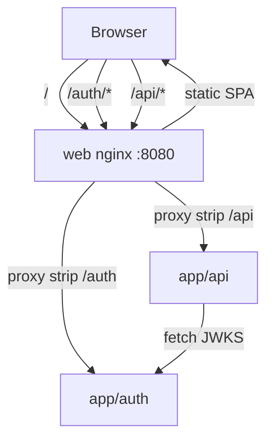

# SPEC-015: app/web OIDC 認証連携(app/auth + app/api Bearer 保護)

## 1. ユーザー価値(なぜ作るか)

> **Task Manager を使うユーザー** が **ログインした状態でのみタスクを閲覧・操作でき**、**開発者** が **app/auth(OIDC 認可サーバー)・app/web(SPA)・app/api(リソースサーバー)の 3 スタックをローカル compose で end-to-end に検証できる**。

- **対象ユーザー**: Task Manager Web UI のエンドユーザー、および cc-orchestrator の 3 アプリ(auth / web / api)をローカルまたは AWS(SPEC-004)で運用する開発者
- **解決する課題**: これまで app/web は未認証の公開 SPA、app/api は Bearer 検証なし、app/auth は compose 上で独立稼働するのみで web から利用されていなかった。SPEC-004 でも「web SPA を OIDC RP として auth と繋ぐ配線」はスコープ外とされていた
- **得られる価値**:
  - ユーザーは Sign in 後にのみタスク一覧・詳細・作成・状態変更ができる
  - web は Authorization Code + PKCE(S256)で app/auth と連携し、access token を app/api へ Bearer として送る
  - ローカルでも本番(SPEC-004)と同型の同一オリジン経路(`/` → web、`/auth/*` → auth、`/api/*` → api)で動作する
- **価値の検証方法**:
  1. `make up-d` 後、`http://localhost:8080` に未ログインでアクセスすると `/login` へ誘導される
  2. Sign in 完了後、タスク一覧が表示され API 呼び出しが成功する
  3. Sign out 後、保護ルートへ再アクセスすると再び `/login` へ誘導される
  4. Bearer なしまたは無効 token で `GET /api/tasks` を叩くと 401 になる
  5. `make -C app/auth check` / `make -C app/api check` / `make -C app/web check` が green

## 2. ユーザー体験(何ができるようになるか)

### ユーザーストーリー

- エンドユーザーとして、Task Manager を開いたとき未ログインなら Sign in を促され、ログイン後にタスクを操作したい。なぜならタスク API を認証済みユーザーのみに限定したいから。
- エンドユーザーとして、ヘッダーに自分の表示名が出て、Sign out でログアウトしたい。なぜなら共有端末等でセッションを残したくないから。
- 開発者として、外部 OIDC ライブラリに依存せず fetch + zod でフローを追えるサンプルにしたい。なぜなら cc-orchestrator は学習・検証用の monorepo だから。

### 利用フロー

#### ログイン

1. ユーザーが保護ルート(`/`, `/tasks/$taskId`)にアクセスする
2. 未認証の場合、`beforeLoad` が元 URL を `sessionStorage` に保存し `/login` へ redirect する
3. ユーザーが **Sign in** を押す
4. web が PKCE `code_verifier` / S256 `code_challenge` / `state` を生成し `sessionStorage` に保存する
5. ブラウザが `{issuer}/authorize` へ redirect する(同一オリジン `/auth/authorize` 経由)
6. app/auth が client / redirect_uri / scope / PKCE を検証し、デモユーザーで自動承認(ログイン UI なし)し `302 {redirect_uri}?code=...&state=...` を返す
7. `/callback` が `code` と `state` を受け取り、`state` 一致を確認して `POST {issuer}/token` で token を交換する
8. ID token から `sub` と表示名を取り出し session を `sessionStorage` に保存する
9. 保存済み return-to(なければ `/`)へ `window.location.replace` で遷移する

#### 認可(API 利用)

1. TanStack Query 経由の API 呼び出し前に、生成クライアントの request interceptor が `Authorization: Bearer {access_token}` を付与する
2. app/api の Bearer ミドルウェアが auth サーバーの JWKS で JWT を検証する(`iss` / `aud` / `exp` / `sub` / RS256 署名)
3. 検証成功時のみ task ハンドラへ到達する

#### ログアウト

1. ユーザーが **Sign out** を押す
2. web が discovery から `revocation_endpoint` を取得し、refresh token があれば `POST /revoke` で失効させる(best-effort)
3. web が `sessionStorage` の auth 関連キーをすべて削除する
4. discovery の `end_session_endpoint`(`GET /logout`)へ redirect し IdP セッションを終了する(`id_token_hint` / `post_logout_redirect_uri` 付き)。エンドポイント未設定時は `/login` へ hard redirect する

#### セッション更新(refresh token)

1. `offline_access` 付きでログインした場合、token 交換で refresh token を sessionStorage に保存する
2. access token の有効期限の **60 秒前**から、`AuthProvider` の定期チェック(30 秒間隔)または API リクエスト直前に `POST /token`(`grant_type=refresh_token`)で silent refresh する
3. 保護ルートの `beforeLoad` でも期限切れ access token + 有効 refresh token なら refresh を試み、成功すれば再ログイン不要
4. refresh 失敗時は `/login` へ誘導する

#### セッション失効(401)

1. access token 期限切れで refresh も失敗した場合、または API 側で 401 が返る
2. API client の error interceptor が refresh を 1 回試行し、失敗時は session をクリアして `/login` へ redirect する

## 3. 要件(何を満たすべきか)

### 機能要件 — app/web

- [x] R1: `features/auth/` feature slice を追加する。domain(PKCE / config / session / token decode)・api(OIDC fetch)・hooks(`AuthProvider`)・components(`LoginButton` / `LogoutButton` / `UserMenu`)に分離する
- [x] R2: OIDC フローは **Authorization Code + PKCE S256** のみ。外部 OIDC クライアントライブラリは使わない
- [x] R3: 設定は Vite env から解決する。未設定時のデフォルト:
  - `VITE_AUTH_CLIENT_ID` → `demo-client`
  - `VITE_AUTH_ISSUER` → `{origin}/auth`
  - `VITE_AUTH_REDIRECT_URI` → `{origin}/callback`
  - `VITE_AUTH_SCOPES` → `openid profile email offline_access`(スペース区切り)
- [x] R4: ルート `/login`(未認証向け)・`/callback`(code 交換)を追加する
- [x] R5: `/` と `/tasks/$taskId` は `beforeLoad` で認証必須。未認証時は return-to を保存して `/login` へ redirect する
- [x] R6: セッションは **sessionStorage** に保存する(タブを閉じると消える)。保存項目: access token / id token / refresh token(任意) / expiresAt / sub / displayName
- [x] R7: App シェルヘッダーに、未認証時 `LoginButton`、認証時 `UserMenu`(表示名 + Sign out)を表示する
- [x] R8: task API クライアントは有効 session があるとき Bearer を付与し、401 時は refresh を 1 回試行したうえで失敗時 session クリア + `/login` redirect する
- [x] R9: `app/web/nginx.conf` に `/auth/` リバースプロキシを追加し、同一オリジン `/auth/*` で auth に到達できるようにする(SPEC-014 の `connect-src 'self'` を維持)
- [x] R16: refresh token による **silent refresh** を実装する。`features/auth/domain/refresh.ts` が token 更新を担当し、`AuthProvider`(定期)・API request interceptor(リクエスト直前)・保護ルート `beforeLoad`(期限切れ復帰)から利用する
- [x] R17: ログアウト時に refresh token の revoke(RFC 7009)と RP-initiated logout(`end_session_endpoint`)を best-effort で実行する

### 機能要件 — app/auth

- [x] R10: seed client `demo-client` の `redirect_uris` に `http://localhost:8080/callback` を追加する(既存 `http://localhost:3000/callback` は route テスト用に維持)
- [x] R11: ローカル compose の `ISSUER` を `http://localhost:8080/auth` に設定する(SPEC-004 の CloudFront `/auth` プレフィックス issuer パターンと一致)

### 機能要件 — app/api

- [x] R12: 全 task エンドポイントを Bearer JWT 必須にする
- [x] R13: `AUTH_ISSUER` / `AUTH_JWKS_URL` / `AUTH_AUDIENCE` が**すべて**設定されているときのみ認証ミドルウェアを有効化する。一部のみ設定は起動失敗(fail-closed on misconfiguration)。※ `AUTH_AUDIENCE` は初版の 2 変数契約に ISSUE-037 で追加された 3 変数目(§6 経緯 2026-07-12 追記参照)
- [x] R14: JWT 検証内容: RS256 署名(JWKS `kid` 解決・5 分キャッシュ)、`exp`、`iss == AUTH_ISSUER`、`aud` に **`AUTH_AUDIENCE`** を含む(ISSUE-037。初版は `AUTH_ISSUER` を aud として検証していたが、リソースサーバー audience 分離により API 向け access token の aud を専用値へ移した)、非空 `sub`
- [x] R15: OpenAPI(`docs/openapi.yaml`)に `BearerAuth` security scheme を追加し、全 task operation に `security` を付与する(SPEC-003)。web は `make generate` で再生成する

### 非機能要件

- **feature-sliced / DDD 整合**: web の domain は React 非依存。api の `TokenVerifier` interface は route(利用側)で定義
- **CSP 維持**: auth 呼び出しは同一オリジン proxy 経由。CSP 文字列の変更は不要(SPEC-014)
- **レスポンシブ**: ログイン画面・ヘッダーユーザーメニューは SPEC-012 / `.claude/rules/web.md` に準拠
- **テスト**: web に pkce / session / config / LoginButton の単体テスト、router テストは session seed で auth guard を通過。api / auth の既存テストは route 直結(ミドルウェア bypass)で非退行

### スコープ外(やらないこと)

後続実装は [AUTH-002 ロードマップ](../plans/AUTH-002-oauth-oidc-gap-roadmap-plan.md) と Issue に分解済み。

- app/auth の **ログイン / 同意 UI** → [ISSUE-031](../issues/20260712-031-auth-login-ui-idp-session.md)(auth 側実装済み。web は authorize redirect 経由で利用)
- **RP-initiated logout / end_session** → [ISSUE-033](../issues/20260712-033-auth-rp-initiated-logout-end-session.md)(web 側も実装済み)
- **ユーザー単位のタスク所有権**(API は token の有効性のみ検証。`sub` による row-level 認可は未実装)
- **ID token のブラウザ内署名検証** → [ISSUE-038](../issues/20260712-038-auth-oidc-claims-offline-access.md) 等
- **RSA 鍵永続化 / JWKS ローテーション** → [ISSUE-036](../issues/20260712-036-auth-rsa-key-persistence-jwks-rotation.md)
- **access token audience(API 向け aud)** → [ISSUE-037](../issues/20260712-037-auth-resource-server-audience.md)
- **confidential client / 管理 API** → [ISSUE-035](../issues/20260712-035-auth-confidential-client.md) / [ISSUE-039](../issues/20260712-039-auth-client-user-management.md)
- **高度 OAuth/OIDC 機能**(introspection / DPoP 等) → [ISSUE-040](../issues/20260712-040-auth-advanced-oauth-oidc-features.md)
- Vite dev server(`bun run dev`)向けの auth proxy(compose / nginx 本番相当構成が正)
- AWS 本番 env の `VITE_AUTH_*` 注入(SPEC-004 の web デプロイ手順は別途。本 Spec は契約とローカル compose を正とする)

## 4. 設計(どう実現するか)

### 方針

**3 スタック横断の最小 E2E 認証**を、既存 auth サーバー(AUTH-001 / SPEC-006)と SPEC-004 の同一オリジン routing パターンを再利用して実現する。web は OIDC RP として振る舞い、api は auth の JWKS を信頼するリソースサーバーとして振る舞う。

### アーキテクチャ

| レイヤ | 主要ファイル | 責務 |
|---|---|---|
| web nginx | `app/web/nginx.conf` | `/auth/` → `http://auth:8080`、`/api/` → `http://api:8080` |
| web auth domain | `src/features/auth/domain/*` | PKCE、env 解決、sessionStorage、JWT payload decode、silent refresh |
| web auth api | `src/features/auth/api/oidc.ts` | discovery / authorize URL / token / refresh / revoke / end-session URL |
| web auth hooks | `src/features/auth/hooks/AuthProvider.tsx` | login / logout / handleCallback / getAccessToken / proactive refresh |
| web router | `src/app/router.tsx` | `/login` `/callback`、保護ルート async `beforeLoad`(refresh 対応) |
| web API client | `src/features/tasks/api/client.ts` | Bearer 注入(silent refresh 付き)、401 → refresh 試行 |
| auth seed | `app/auth/cmd/authz/main.go` | `demo-client` redirect URIs、compose issuer |
| api middleware | `app/api/route/auth_middleware.go` | Bearer 抽出・401 JSON |
| api JWT | `app/api/infra/jwt/verifier.go` | JWKS fetch + RS256 検証 |
| api env | `app/api/cmd/api/env.go` | `AUTH_ISSUER` / `AUTH_JWKS_URL` / `AUTH_AUDIENCE`(ISSUE-037) |
| compose | `compose.yml` | issuer / jwks / web→auth depends_on |

### 環境変数契約(ローカル compose)

| サービス | 変数 | 値(ローカル) |
|---|---|---|
| auth | `ISSUER` | `http://localhost:8080/auth` |
| api | `AUTH_ISSUER` | `http://localhost:8080/auth` |
| api | `AUTH_JWKS_URL` | `http://auth:8080/.well-known/jwks.json`(Docker 内部) |
| api | `AUTH_AUDIENCE` | `http://localhost:8081/api`(auth の `API_AUDIENCE` と一致。ISSUE-037) |
| web(build) | `VITE_AUTH_*` | 未設定時は実行時 `{origin}` から導出 |

> **fail-closed on misconfiguration**: api は上記 `AUTH_ISSUER` / `AUTH_JWKS_URL` / `AUTH_AUDIENCE` の 3 変数を all-or-nothing で検証する(`cmd/api/env.go` `validate()`)。3 変数すべて設定で認証有効、すべて未設定で「認証なし(dev opt-out)」、一部のみ設定は起動失敗。AWS デプロイ経路(app/iac)でこの 3 変数を確実に配線することは ISSUE-041 で別途担保する。

### OpenAPI / 型契約(SPEC-003)

- `components.securitySchemes.BearerAuth`: HTTP bearer JWT
- 全 task paths に `security: [{ BearerAuth: [] }]` と `401` 応答
- web の `make generate` 後、生成 SDK の各 operation に `security` メタデータが付く(実際の header 注入は client interceptor が担当)

### 検討した代替案と不採用理由

| 案 | 不採用理由 |
|---|---|
| web から auth `:8082` へ cross-origin 直接 fetch | CSP `connect-src 'self'` 違反。CORS 設定も auth に未実装 |
| `localStorage` で token 保持 | XSS 時の漏洩リスクが sessionStorage + タブスコープより広い。サンプルでは sessionStorage を採用 |
| api が auth と同一 RSA 鍵を共有 | auth は起動時メモリ鍵生成のため非現実的。JWKS フェッチが正 |
| ID token を api に送る | access token が Bearer 標準。aud 設計も userinfo 向け access token を api が再利用 |

## 5. 実装計画

- [x] T1: app/auth — redirect_uri 追加、compose `ISSUER` 更新
- [x] T2: app/web — `features/auth/`、router / App shell、nginx `/auth` proxy、MSW OIDC mock
- [x] T3: app/api — JWKS verifier、auth middleware、OpenAPI BearerAuth、compose env
- [x] T4: app/web — `make generate` で OpenAPI 再生成
- [x] T5: checker — `make -C app/{auth,api,web} check` green

## 6. 経緯(時系列・追記のみ)

### 2026-07-12

- 初版作成。app/web に OIDC RP 連携、app/api に Bearer JWT 保護、ローカル compose の同一オリジン `/auth` proxy を実装済みの状態を Spec 化。SPEC-004 でスコープ外だった「web を auth OIDC client として接続」はローカル E2E について本 Spec で充足。refresh token 自動更新・ユーザー別タスク認可・auth ログアウト API はスコープ外として明記
- 実装・検証完了。`make -C app/auth check` / `make -C app/api check` / `make -C app/web check`(138 tests) green。status を `done` に更新
- スコープ外の app/auth OAuth/OIDC ギャップを [AUTH-002 ロードマップ](../plans/AUTH-002-oauth-oidc-gap-roadmap-plan.md) と ISSUE-031〜040 に分解。frontmatter `issues` を更新
- web 改善: silent refresh 配線(`features/auth/domain/refresh.ts`)、MSW OIDC mock に revoke/logout/refresh 追加、ログアウトフロー記述を auth 実装(end_session + revoke)に同期。R16/R17 追加

- **リポジトリ全体レビューでの仕様陳腐化の是正(ISSUE-046)**。初版の R13/R14・環境変数契約は 2 変数(`AUTH_ISSUER` / `AUTH_JWKS_URL`)を前提にしていたが、その後 ISSUE-037(リソースサーバー audience 分離)で api に 3 変数目 `AUTH_AUDIENCE` が追加され、実装は (a) `cmd/api/env.go` `validate()` が 3 変数の all-or-nothing 検証(`app/api/cmd/api/env.go:164-186`)、(b) `infra/jwt` の aud 検証対象が `AUTH_ISSUER` → `AUTH_AUDIENCE` へ変更(`NewVerifier(jwksURL, issuer, audience)`・`claims.Audience.contains(v.audience)`、`app/api/infra/jwt/verifier.go:111,174` / 配線 `cmd/api/main.go:92`)に変わっていた。Spec 側(R13/R14/§4 環境変数契約表・ファイル対応表)がこの契約変更を反映しておらず陳腐化していたため、実装を正として本 Spec を現状に合わせて更新した(実装は正常。ドキュメントレベルの是正)。ローカル compose の値は `AUTH_AUDIENCE=API_AUDIENCE=http://localhost:8081/api`。あわせて、AWS デプロイ経路でこの 3 変数が配線されず apply 後の Task API が無認証公開になる Blocker は ISSUE-041 として別途起票済み。status は `done` を維持(実装は要件を満たしており、変更は仕様文書の現実同期のみ)。
